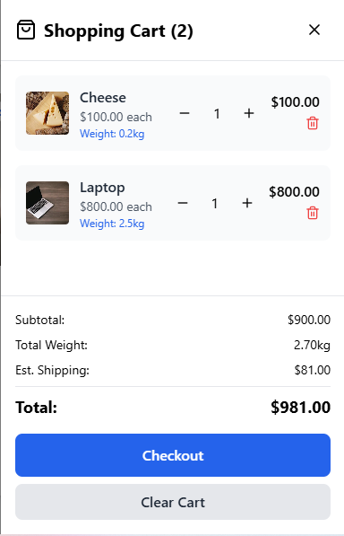
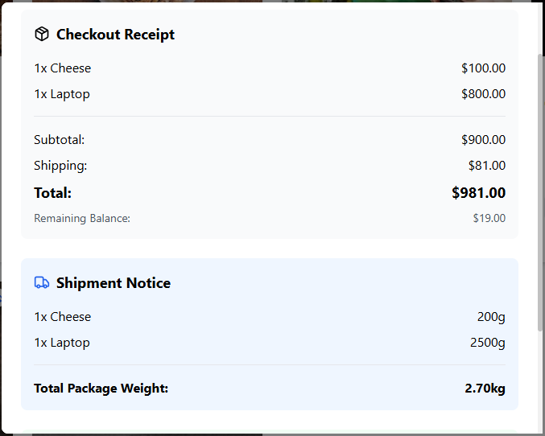

# E-Commerce System

[](https://www.typescriptlang.org/)
[](https://reactjs.org/)
[](https://tailwindcss.com/)
[](https://vitejs.dev/)

A modern, full-featured e-commerce system with integrated digital wallet functionality, built with React, TypeScript, and Tailwind CSS. This application demonstrates advanced product management, shopping cart operations, and checkout processes.

## Features

- **Product Management** - Support for different product types (perishable/non-perishable, shippable/non-shippable)
- **Shopping Cart** - Add, remove, and manage products with real-time validation
- **Checkout System** - Complete checkout with balance verification and receipt generation
- **Digital Wallet** - Add funds, view balance, and transaction history
- **Responsive Design** - Works on desktop and mobile devices
- **Dark/Light Theme** - Toggle between themes

### Prerequisites

- **Node.js** (v18.0.0 or higher)
- **npm** (v8.0.0 or higher) or **yarn** (v1.22.0 or higher)
- **Git** for version control

### Step-by-Step Setup

1. **Clone the repository**

   ```bash
   git clone https://github.com/your-username/e-commerce-fawry.git
   cd e-commerce-fawry
   ```

2. **Install dependencies**

   ```bash
   npm install
   # or
   yarn install
   ```

3. **Set up environment variables**

   ```bash
   cp .env.example .env.local
   ```

   Configure your `.env.local` file:

   ```env
   VITE_API_BASE_URL=http://localhost:3001
   ```

4. **Start the development server**

   ```bash
   npm run dev
   # or
   yarn dev
   ```

5. **Open your browser**
   Navigate to `http://localhost:5173`

## 📖 How to Use

### Adding Products to Cart

- Browse products on the main page
- Select quantity and click "Add to Cart"
- View cart by clicking the cart icon in the header

### Checkout Process

- Open cart sidebar
- Review items and total
- Click "Checkout" to process payment
- View receipt and shipment details

## Tech Stack

- **React 18** - UI framework
- **TypeScript** - Type safety
- **Tailwind CSS** - Styling
- **Vite** - Build tool
- **Lucide React** - Icons

## Project Structure

```plaintext
src/
├── components/          # React components
├── services/           # Business logic
├── types/              # TypeScript types
├── hooks/              # Custom React hooks
├── data/               # Sample data
└── App.tsx             # Main app component
```

## Testing

```bash
# Run tests
npm run test

# Build for production
npm run build
```

## Screenshots

### Shopping Cart



### Checkout Receipt



## Contributing

1. Fork the repository
2. Create a feature branch
3. Make your changes
4. Submit a pull request

## License

MIT License - see [LICENSE](LICENSE) file for details.

## Contact

For questions or support, please open an issue on GitHub.
